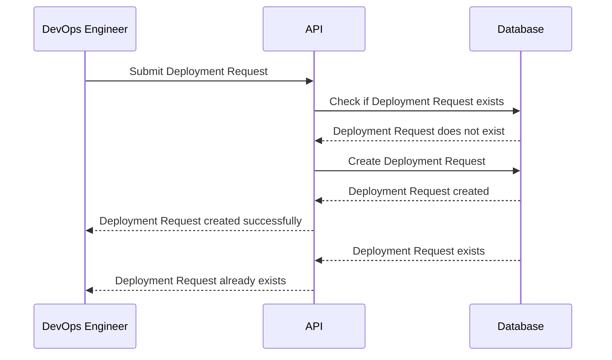
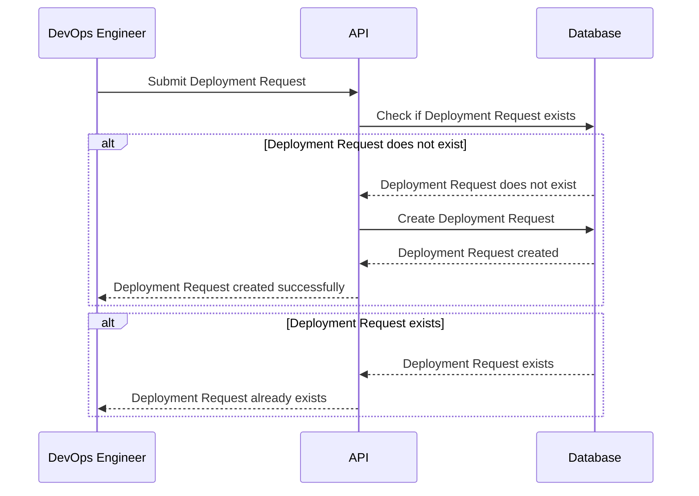

# ChatGPT Chat Log

## User Story Creation

### Prompt:

> Create a simple user story for submitting a request to an API that creates a deployment request (if it doesn't already exist) in a database for further processing.

### Response:

> As a DevOps engineer, I want to be able to submit a deployment request to an API that creates the request in a database for further processing. If the request already exists, I want to receive a notification that the request has already been created. This will allow me to streamline the deployment process and ensure that all requests are properly tracked and processed. 

## Sequence Diagram Generation

### Prompt:

> Create a sequence diagram using mermaid.js syntax that represents the process in the user story.

### Response:

> Unfortunately, as a language model AI, I am not able to create and display images or diagrams. But I can provide you with the mermaid.js syntax for a sequence diagram that represents the process in the user story:



## Sequence Diagram Modification

### Prompt:

> Can you update the diagram to wrap the two different outcomes in alternate path groupings?

### Response:

> Sure, here's the updated sequence diagram with the two different outcomes wrapped in alternate path groupings:




## GitHub Markdown File Creation

### Prompt:

> Can you generate a github markdown file that includes a title, the user story, and the mermaid diagram code in a code block using triple backticks and the mermaid annotation?

### Response:

> Certainly! Here's a Github markdown file that includes the title, the user story, and the mermaid diagram code in a code block using triple backticks and the mermaid annotation:

```
# Deployment Request API

## User Story
As a DevOps engineer, I want to be able to submit a deployment request to an API that creates the request in a database for further processing. If the request already exists, I want to receive a notification that the request has already been created. This will allow me to streamline the deployment process and ensure that all requests are properly tracked and processed.

## Sequence Diagram
```mermaid
sequenceDiagram
DevOps Engineer->>API: Submit Deployment Request
API->>Database: Check if Deployment Request exists

alt Deployment Request does not exist
Database-->>API: Deployment Request does not exist
API->>Database: Create Deployment Request
Database-->>API: Deployment Request created
API-->>DevOps Engineer: Deployment Request created successfully
end

alt Deployment Request exists
Database-->>API: Deployment Request exists
API-->>DevOps Engineer: Deployment Request already exists
end```
```
