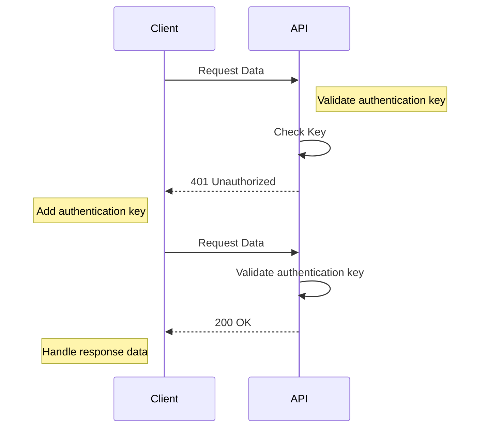

# Example API with Auth Sequence Diagram

```mermaid
sequenceDiagram
  participant Client
  participant API

  Client->>API: Request Data
    Note right of API: Validate authentication key
  API->>API: Check Key
  API-->>Client: 401 Unauthorized
    Note left of Client: Add authentication key
  Client->>API: Request Data
  API->>API: Validate authentication key
  API-->>Client: 200 OK
    Note left of Client: Handle response data
```