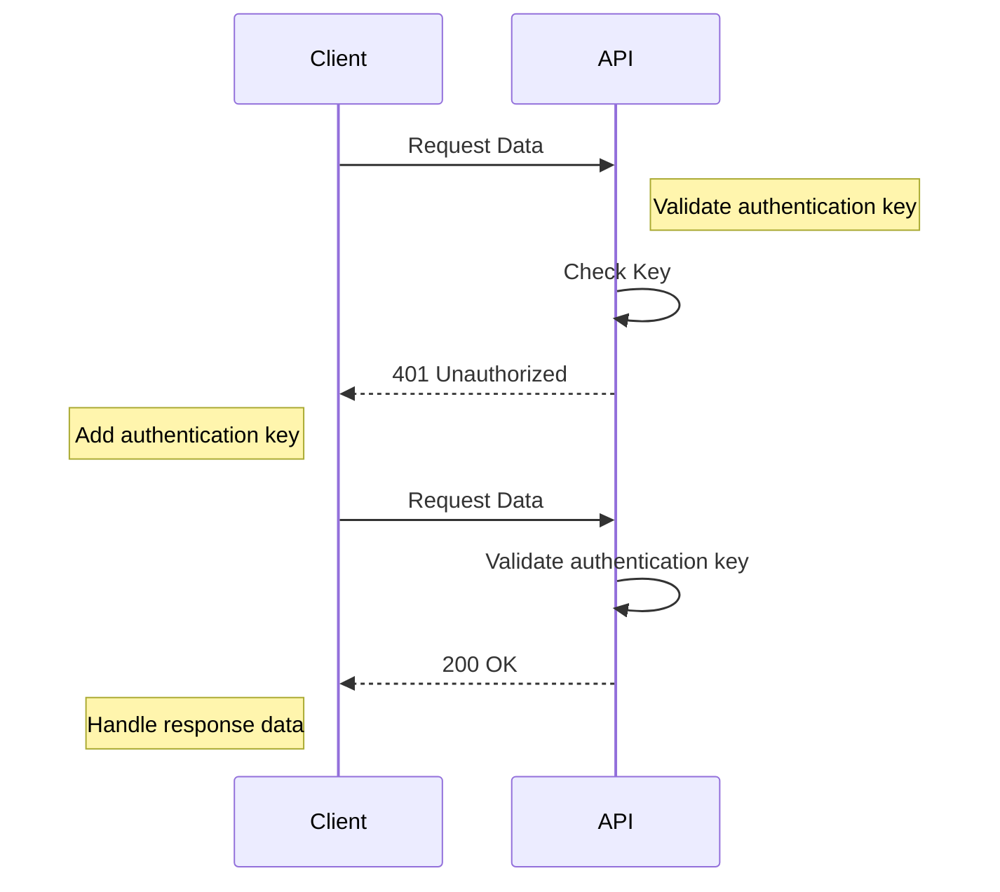

# ChatGPT Demo - Example API with Auth Sequence Diagram

## ChatGPT Interaction

### Original Prompt

> Create a mermaid.js sequence diagram for an API request that requires an authentication key and returns a response with data.

### ChatGPT Response

> Here's a sample Mermaid.js sequence diagram for an API request that requires an authentication key and returns a response with data:

```
sequenceDiagram
  participant Client
  participant API

  Client->>API: Request Data
    Note right of API: Validate authentication key
  API->>API: Check Key
  API-->>Client: 401 Unauthorized
    Note left of Client: Add authentication key
  Client->>API: Request Data
  API->>API: Validate authentication key
  API-->>Client: 200 OK
    Note left of Client: Handle response data

```

> In this diagram, the client makes a request for data to the API. The API then checks the provided authentication key and returns a 401 Unauthorized response if it's not valid. The client then adds the correct authentication key and repeats the request. The API validates the key again and returns a 200 OK response along with the requested data.

## GitHub Integration

GitHub Markdown files natively supports mermaid syntax for the most popular diagram types. By just annotating the codeblock with "mermaid" i.e. ` ```mermaid` GitHub will display the rendered diagram inline as seen below.


